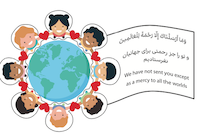
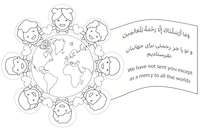
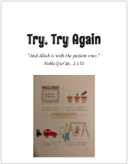

# UBC Youth and Children Programs

## 13th of Rajab 1443
Birth of Imam Ali (A.S.)
### Craft: Yaa Ali Decorations: 

| **Worksheet (Color)** | **Worksheet (B&W)** | **Video** |
|  |  | |

## 20th of Jamadi al-Thani 1443
Birth of Lady Fatimah Zahra (S.A.)
### Craft: Mother's day gift: 

| **Video** | **Worksheet** |
|  |  |

## 17th of Rabee'ul-Awwal 1443
Birth of Prophet Muhammad (S.A.) and Imam Ja'far Saadiq (A.S.). 
### Craft: Merci to all the Worlds (Rahmatan Lil Aalameen): 

| | **Video** | |
|---|---|---|
|  |  | |
| | **Worksheets** | |
|  |   |  |

## Muharram 1443

### Craft: Ashura Model

| | [Download Ashura Model Workbook](resources/CraftAshuraModelWorksheet.pdf) | |
|---|---|---|
|  |  |  | 
|  |  |  |

### Worksheets

|  |  |  |
|---|---|---|
|  |  |  |
|  |  |  |

### Other Activities
 - Reciting Salaam of Imam Hussain.
 - Preparing a location in your home for Muharram.
 - Video: The Master of Martyrs,  by Sheikh Azhar: [Quiz](https://docs.google.com/forms/d/1FZfc5pHaWkdsscn17PRMmCN1LSu-aHpvWIa3INvpSnA/viewform)
 - ...

## Media

### Mariyeh's Letters

|   |  |  |
|---|---|---|
|  |  |  |
|  |  |  |
| |  | |

 
